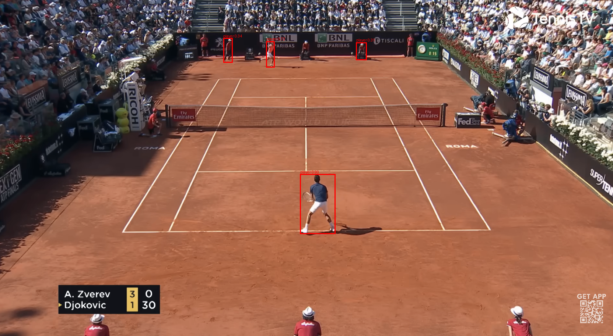
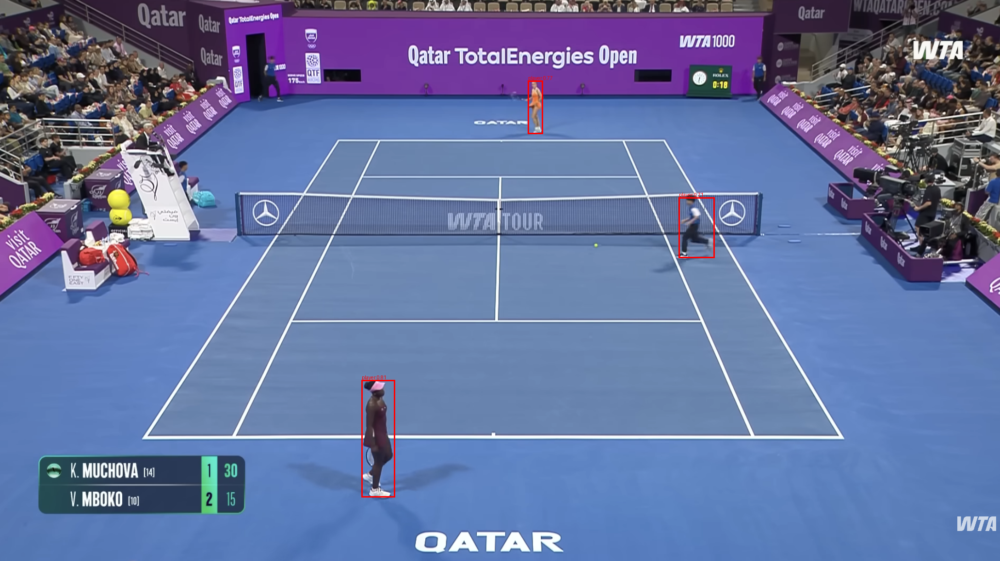
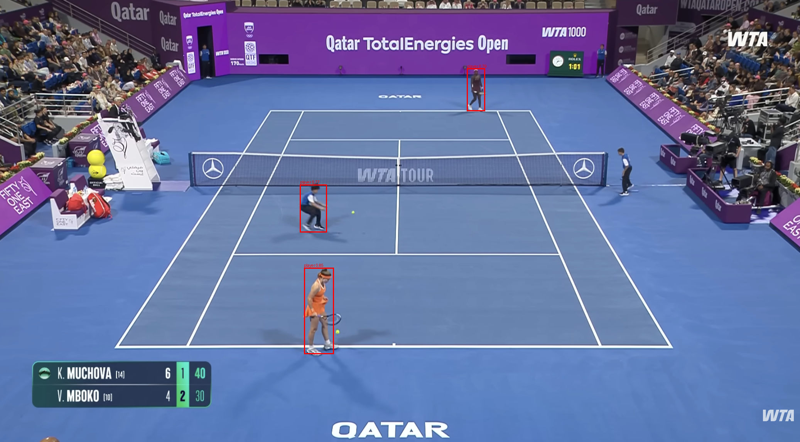

# Detection Experiments

## Dataset

| Version | Date | Splits | Notes |
| --- | --- | --- | --- |
| detection_cvat_v1 | YYYY-MM-DD | train / val / test | Corrected player boxes from CVAT. |

## Current Baseline

| Field | Value |
| --- | --- |
| Model | yolo11s.pt |
| Dataset | detection_cvat_v1 |
| Training run | 50bbeedc56394af7b96c42947f15d5f7 |
| Evaluation run | 82950eb7b17d4507b12dad5f59ed746a |
| mAP50 | 0.9240 |
| mAP50-95 | 0.7443 |
| Precision | 0.8922 |
| Recall | 0.8778 |
| Notes | Current best completed detection baseline: yolo11s at imgsz 1280. |

## Experiment Table

| Status | Run name | Model | Dataset | imgsz | Epochs | Batch | Device | Train run ID | Eval run ID | mAP50 | mAP50-95 | Precision | Recall | Notes |
| --- | --- | --- | --- | ---: | ---: | ---: | --- | --- | --- | ---: | ---: | ---: | ---: | --- |
| done | yolo11n_img960_ep30 | yolo11n.pt | detection_cvat_v1 | 960 | 30 | 4 | auto | 7af28936c39942d0957b3c17ac090ec4 | 3f68f824a3b5474b9a4e10b4507b881b | 0.9296 | 0.7144 | 0.9660 | 0.8485 | First baseline; very high precision, but lower recall suggests some players are missed. mAP75: 0.8111, fitness: 0.7144 |
| done | yolo11s_baseline_20260617_183029 | yolo11s.pt | detection_cvat_v1 | 960 | 30 | 4 | auto | 9c5fab84168e4ef285c40e0407f8eb7f | a062d019565c4a94a251511686772e2f | 0.9301 | 0.7243 | 0.9278 | 0.8636 | Better overall than 11n at 960; recall improves, likely from slightly stronger model capacity. mAP75: 0.7940, fitness: 0.7243 |
| done | yolo11m_img960_ep30 | yolo11m.pt | detection_cvat_v1 | 960 | 30 | 4 | auto | 5a212fa0cd7d494d8926d2b0c734bc71 | bea2e88524744d3aabefe22cedc387ad | 0.9009 | 0.6913 | 0.8996 | 0.8561 | Larger model did not help; likely too heavy for dataset size or overfits/noisier boxes. mAP75: 0.7311, fitness: 0.6913 |
| done | yolo11s_img1280_ep30 | yolo11s.pt | detection_cvat_v1 | 1280 | 30 | 2 | auto | 50bbeedc56394af7b96c42947f15d5f7 | 82950eb7b17d4507b12dad5f59ed746a | 0.9240 | 0.7443 | 0.8922 | 0.8778 | Best so far; higher image size likely helps with small/far players. mAP75: 0.8249, fitness: 0.7443, evaluated from weights/best.pt |
| done | yolo11n_img1280_ep30 | yolo11n.pt | detection_cvat_v1 | 1280 | 30 | 2 | auto | c8e926040e404eb09d1b4755ad1ca90c | 3aa2712a9266435fbfbde6df76ad6e98 | 0.8979 | 0.6589 | 0.8623 | 0.8542 | Increasing image size alone did not help 11n; small model may lack capacity at this resolution. mAP75: 0.7074, fitness: 0.6589, evaluated from weights/best.pt |
| done | yolo11s_img960_ep50 | yolo11s.pt | detection_cvat_v1 | 960 | 50 | 4 | auto | cf240eb183af4d28b7595b0589f088a8 | 75e2a4bca11248c789851ecb4bde7f21 | 0.9124 | 0.7233 | 0.9185 | 0.8543 | Longer training at 960 did not beat 11s at 1280; image size seems more useful than extra epochs here. mAP75: 0.8086, fitness: 0.7233, evaluated from weights/best.pt |

## Hard Examples

| Image | Split | Model | Problem | Likely Cause | Next Action |
| --- | --- | --- | --- | --- | --- |
| experiments/detection/assets/img_imp1_det.png | val / improvement set | yolo11s_img1280_ep30 | Ball kids / staff near the back of the court are detected as `player` together with the real player. | Current dataset has too few hard negatives with non-player people on court; visually, ball kids and referees look similar to distant players. | Add more hard negative frames from match videos and annotate only actual players; keep ball kids, referees, and staff unlabelled unless moving to a multi-class setup. |

### Ball Kids / Staff False Positives

| Example 1 | Example 2 | Example 3 |
| --- | --- | --- |
|  |  |  |

These examples show a repeated failure mode: ball kids / staff visible on or near the court are detected as `player`. The next dataset iteration should include more hard negative frames from match videos, with annotations kept only on actual players.

Important dataset balance: adding many ball kid / staff negatives may make the model too restrictive around court edges and background areas. The next dataset version should also add hard positive examples where real players are close to the net, close to court boundaries, partially outside the main court area, or visually similar to staff positions. This should help the model learn the difference between role/context and actual player appearance instead of simply suppressing people near the edges.

## Commands

### Train

```bash
uv run python -m tennisvision.tasks.detection.scripts.run_experiment \
  --model yolo11n.pt \
  --run-name yolo11n_img960_ep30 \
  --epochs 30 \
  --imgsz 960 \
  --batch 4
```

### Evaluate Local Checkpoint

```bash
uv run python -m tennisvision.tasks.detection.scripts.evaluate \
  --model-path data/artifacts/detection/yolo11n_img960_ep30/weights/best.pt \
  --data-config data/detection/data.yaml \
  --split test \
  --dataset-tag detection_cvat_v1 \
  --model-tag yolo11n_img960_ep30
```

### Evaluate MLflow Artifact

```bash
uv run python -m tennisvision.tasks.detection.scripts.evaluate \
  --run-id <train_run_id> \
  --model-artifact-path models/best.pt \
  --data-config data/detection/data.yaml \
  --split test \
  --dataset-tag detection_cvat_v1 \
  --model-tag yolo11n_img960_ep30
```

### Single Image Check

```bash
uv run python -m tennisvision.tasks.detection.scripts.infer \
  --image data/detection/images/test/<image>.png \
  --model-path data/artifacts/detection/yolo11n_img960_ep30/weights/best.pt \
  --visualize true
```

## Manual Inspection Set

| Image | Reason | Expected behavior | Observed behavior | Action |
| --- | --- | --- | --- | --- |
|  | far player | detects player with tight box |  |  |
|  | multiple people | detects tennis player, ignores audience |  |  |
|  | partial occlusion | detects visible player body |  |  |
|  | shadow / low contrast | box stays on player, not shadow |  |  |

## Error Cases

| Type | Examples | Likely cause | Next action |
| --- | --- | --- | --- |
| False positive on audience |  | background people look like player | add negatives / more court context |
| Missed far player |  | small object | higher imgsz / more examples |
| Box too large |  | player + shadow / court area | improve labels / augmentations |
| Wrong person detected |  | ball boy / referee | add hard negatives |

## Notes

- Evaluation confidence should usually stay low, for example `0.001`, because mAP is computed across a precision-recall curve.
- API/inference confidence can be higher, for example `0.25`, `0.35`, or `0.5`, depending on visual behavior.
- Prefer comparing models on the same dataset version and split.
