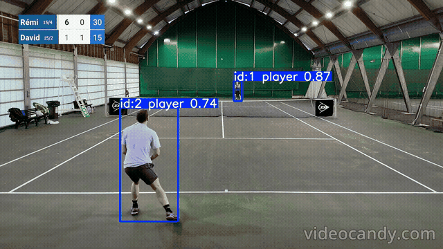
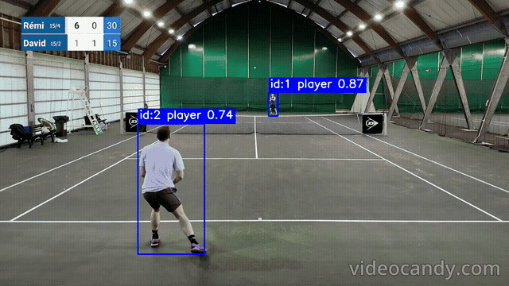

# Video Tracking Experiments

## Current Baseline

| Field | Value |
| --- | --- |
| Baseline version | v1 |
| Detector | yolo11s_img1280_ep50_playersv2 |
| Detector run ID | d21d335020d14f4498d5388aebebd03b |
| Model artifact path | weights/best.pt |
| Tracker | ByteTrack |
| Tracker config | bytetrack_tennis.yaml |
| imgsz | 1280 |
| Confidence | 0.5 |
| new_track_thresh | 0.8 |
| track_buffer | 120 |
| Duplicate IoU threshold | 0.5 |
| Normal max stitch frame gap | 120 |
| Normal max stitch gap ratio | 0.18 |
| Normal max stitch center distance | 250 |
| Normal max stitch center distance ratio | 0.12 |
| Re-entry max stitch frame gap | 180 |
| Re-entry max stitch gap ratio | 0.25 |
| Re-entry max stitch center distance | 700 |
| Re-entry max stitch center distance ratio | 0.35 |
| Re-entry side ratio | 0.4 |
| Singles max tracks | 2 |
| Doubles max tracks | 4 |
| Status | Accepted practical baseline v1 |
| Notes | Current baseline is tuned for stable player identity across tested clips, including short re-entry gaps. It is not treated as a final tracker. |

This configuration is the current video tracking pipeline baseline v1. It is intentionally explicit: the parameters are frozen as a practical baseline so future work can compare against a stable reference instead of continuously changing tracker/postprocessing behavior. Further changes should be introduced as new experiments rather than silently modifying the baseline.

## Notes

Initial video tracking experiments showed that the detector was able to localize both near and far players reliably. However, the tracker often fragmented the identity of the same player into multiple `track_id`s. This happened even in simple singles clips, where the near player was consistently detected but the assigned ID changed between consecutive parts of the rally.

Increasing detection confidence to `0.5` removed most false positives on ball kids and referees in the tested video clips. This threshold is currently used for video tracking inference, but it should still be checked against harder clips with far, occluded, or low-contrast players.

Both ByteTrack and BoT-SORT were tested on the same video clips. BoT-SORT produced similar ID switches, so the issue was not solved by changing the tracker type alone.

## Qualitative Comparison

| Before threshold tuning | After threshold tuning |
| --- | --- |
|  |  |

The tuned setup uses a higher detection confidence and a higher `new_track_thresh`. In this example, the player detections remain stable while unnecessary detections and new track creation are reduced.

## Tracker Choice

ByteTrack is used as the current baseline tracker. In the tested tennis clips, BoT-SORT did not produce a clear qualitative improvement over ByteTrack: both trackers localized players similarly and both could still produce ID switches. Since the tracking quality was comparable, ByteTrack is preferred because it is simpler, has fewer moving parts, and is easier to tune/debug for the current stage of the project.

BoT-SORT remains a candidate for later experiments, especially if camera motion, longer occlusions, or ReID-based identity recovery become a larger problem. For now, the main improvement came from detection confidence and `new_track_thresh`, not from changing the tracker family.

The most impactful tracker parameter was `new_track_thresh`. Increasing it to `0.8` significantly reduced unnecessary creation of new track IDs, because the tracker became more conservative when deciding that a detection should start a new track instead of being associated with an existing one.

Additional tests with different `track_buffer` values did not noticeably change the result. This suggests that the main issue was not how long lost tracks were kept in memory, but how easily the tracker created new identities. Therefore, the current baseline uses ByteTrack with a higher `new_track_thresh` and a moderate `track_buffer`.

## Postprocessing Motivation

After testing the current detector and tracker on multiple videos, the remaining errors looked mostly like video-level track selection and identity consistency problems rather than pure detection failures. The detector is able to find tennis players reliably, including players on neighboring courts. This is expected because the detection class is defined broadly as `tennis_player`, not only as the active players on the main court.

Therefore, the next stage is postprocessing: the detector/tracker can return all plausible tennis-player tracks, and a separate video-level step should clean short unstable tracks, repair simple ID fragmentation, and eventually select the main-court players.

## Postprocessing Iteration 1

The first postprocessing iteration adds a conservative pipeline focused on cleanup and simple ID repair:

1. Compute per-track statistics:
   - `count`
   - `first_frame`, `last_frame`
   - `duration_frames`
   - `presence_ratio`, `duration_ratio`
   - `mean_conf`
   - `mean_box_area`
   - `total_path_distance`
   - first/last box center

2. Filter short tracks:
   - very short tracks are removed before stitching;
   - the minimum required count is dynamic: it uses both an absolute minimum and a ratio of total video length.

3. Stitch adjacent track fragments:
   - intended for cases where one track ends and another begins shortly after;
   - matching uses frame gap/overlap, center distance, and box area ratio;
   - this handles simple `old_id -> new_id` fragmentation cases.

4. Deduplicate frame-level conflicts:
   - after stitching, multiple boxes may temporarily share the same `(frame_id, track_id)`;
   - the current rule keeps the highest-confidence box for each `(frame_id, track_id)` pair.

5. Render a postprocessed video:
   - raw JSON is not enough to judge tracking quality;
   - the postprocessing script now writes `tracks_postprocessed.json`, `postprocessing_info.json`, and `video_postprocessed.mp4`.

This iteration intentionally does not yet solve all identity problems. It is a first cleanup pass, not a full player-selection system.

## Postprocessing Iteration 2

The second postprocessing iteration adds overlap-based duplicate track merging. This targets cases where two track IDs exist at the same time and describe the same player, rather than cases where one track ends and another starts later.

Added steps:

1. Group detections by `track_id` and `frame_id`.
2. Compare pairs of tracks that overlap in time.
3. Compute box IoU on shared frames.
4. Merge tracks when they overlap for enough frames and have sufficiently high mean IoU.
5. Deduplicate detections again after merging to keep one box per `(frame_id, track_id)`.

On `video6`, this helped with the observed identity-mixing issue where `player 1` was previously confused with `player 4`. After adding overlap-based duplicate merging, this specific ID conflict was no longer visible in the postprocessed output.

This does not solve every remaining issue. In the same set of qualitative checks, a person on the right side of the frame was still detected and tracked as `player`, even though they were not an active player and barely moved. This is not an overlap-duplicate problem; it requires an additional active-player selection step.

## Postprocessing Iteration 3

The third postprocessing iteration adds active-player scoring and optional `max_tracks` filtering. The goal is to keep the most relevant match players from all valid tennis-player detections returned by the detector/tracker.

Added steps:

1. Compute an active-player score per track using:
   - `presence_ratio`
   - `mean_conf`
   - normalized path distance
   - normalized box area

2. Add optional `max_tracks` filtering:
   - singles clips can be evaluated with `--max-tracks 2`;
   - doubles clips can be evaluated with `--max-tracks 4`;
   - when `max_tracks` is not provided, scores are still logged for diagnosis but no active-player filtering is applied.

3. Log postprocessing summary:
   - `summary_postprocessed.json`
   - `postprocessing_info.json`
   - MLflow metrics matching the original video tracking summary.

This helped remove inactive or irrelevant player-like tracks in several clips. However, a global top-N ranking can fail when the same real player is split into multiple track IDs before active selection. In that case, top-2 can select two fragments of the same player and remove the opponent. This was observed on `video6` before stitching parameters were relaxed.

To address this, the stitching configuration was made tunable from the CLI:

- `--max-stitch-frame-gap`
- `--max-stitch-gap-ratio`
- `--max-stitch-center-distance`
- `--max-stitch-center-distance-ratio`
- `--max-stitch-overlap-ratio`

Using a more permissive stitching setup fixed the re-entry identity issue on `video2` and `video6`:

```bash
--max-stitch-frame-gap 180
--max-stitch-gap-ratio 0.25
--max-stitch-center-distance 700
--max-stitch-center-distance-ratio 0.35
```

With these settings, players that temporarily disappeared from the frame and were later re-detected with a new tracker ID were stitched back to the original identity. This preserved identity continuity after re-entry and made `--max-tracks 2` safer for those clips.

The same behavior was later useful for doubles clips as well. Some players can still be missed for a few frames when they are partially occluded, move quickly, or appear near court/image boundaries, but the postprocessing can restore the original identity once detections resume. The output is therefore not perfect frame-by-frame, but the player identity is stable enough for a practical baseline.

For doubles, the stitching threshold needs to be more conservative than for singles. A permissive singles-style setting can incorrectly merge different players or even a neighboring-court player into an active-player identity. On `doubles_2`, reducing the stitch center-distance threshold prevented these incorrect merges and produced a cleaner four-player output. The remaining issue was that one player disappeared for about two seconds of an eleven-second clip and was not recovered afterward. This is an acceptable trade-off for the current doubles baseline: it is better to leave a missing segment unresolved than to merge the track into the wrong person.

There is still a separate detector/input limitation: when a player becomes heavily clipped near the image border or leaves the frame, the detector may miss them for several frames. Postprocessing can preserve the same identity after the player is detected again, but it does not create missing boxes for frames where no detection exists.

## Postprocessing Iteration 4

The fourth postprocessing iteration makes stitching aware of player re-entry near frame boundaries. The previous version only treated a track as a re-entry candidate when the old track ended near a frame edge and the new track started near the same exact edge. This was too strict for some clips.

The main observed failure was on `video6`: the near player left or became heavily clipped near the left edge, but the detector only picked the player up again once they had already moved farther inside the frame. Because the new fragment did not start close enough to the exact edge, the postprocessing used the stricter normal stitching thresholds and failed to merge:

- `track 2`: first fragment of the near player;
- `track 3`: same near player after re-entry;
- `track 1` and `track 4`: far-player fragments handled by overlap merging.

This caused active-player selection to keep two fragments of the near player and drop the far player. The fix was to distinguish two kinds of stitching:

- normal stitching: conservative, for adjacent fragments inside the frame;
- re-entry stitching: more tolerant, but only when the old track ended near an edge and the new track begins on the same broad side of the image.

The new re-entry logic uses:

- `edge_margin_ratio`: defines what counts as close to an image edge;
- `reentry_side_ratio`: defines a wider side region, e.g. the left 40% of the image for a left-edge re-entry;
- separate re-entry limits for frame gap, center distance, and box area ratio.

This means that a player can disappear at the left edge and be stitched back even if the detector only redetects them slightly deeper inside the left side of the frame. This is more realistic for tennis videos, because the detector often misses the first few frames after a player re-enters while heavily clipped, blurred, or partially outside the image.

Qualitative example from `video6`:

| Before re-entry-aware postprocessing | After re-entry-aware postprocessing |
| --- | --- |
|  |  |

In the raw tracking output, the player receives a different ID after re-entering the frame. After re-entry-aware postprocessing, the fragment is stitched back to the same player identity. The remaining gap immediately after re-entry is still visible: the player is not detected for a short period before the detector starts producing boxes again. This is a detector/input limitation rather than an ID stitching problem.

Validation after this change:

| Clip | Expected behavior | Result | Notes |
| --- | --- | --- | --- |
| video6 | Stitch near-player `3 -> 2`, keep far player after `4 -> 1` overlap merge | pass | `overlap_mapping` contained `4 -> 1`; `stitching_mapping` contained `3 -> 2`. This fixed the case where active selection previously dropped the far player. |
| doubles_2 | Avoid reintroducing wrong cross-player / neighboring-court merges | pass | The stricter normal stitching still protected doubles identity consistency. The broad-side re-entry change did not break the previously improved result. |
| doubles_3 | Preserve the improved re-entry behavior for a player leaving the frame | pass | The output remained stable after the change. |

The important conclusion is that re-entry should not be treated the same as ordinary within-frame stitching. Ordinary stitching should remain conservative to avoid merging different players. Re-entry stitching can be more tolerant, but only when the spatial pattern supports it: the old track ends near a frame edge and the new track starts on the same broad side of the image.

## Current Limitations

The current postprocessing handles short noisy tracks, simple adjacent ID switches, and some overlapping duplicate tracks, but some observed errors require additional logic:

- Missing detections near image borders: heavily clipped players can disappear for a few frames before being detected again.
- Re-entry detection gap: even when postprocessing restores the original ID after re-entry, it cannot fill the short interval where the detector produced no box.
- Global active-player ranking: `--max-tracks 2` can fail if one real player is split into multiple high-scoring fragments before stitching.
- Perspective-specific selection: top-N scoring works for many clips, but a better strategy may be needed for different camera perspectives.
- Main-court player selection: players on neighboring courts may be valid `tennis_player` detections, but they should not necessarily be selected as active players for the main match.

The next postprocessing iteration should explore spatially balanced active-player selection. For standard back-view tennis videos, this may mean selecting one strong track from the near side and one from the far side of the court. For side-view cameras, a more general spatial-diversity strategy may be needed instead of assuming that image `y` position corresponds to near/far court position.

## Baseline Validation

The current baseline should be validated on a fixed set of representative held-out clips before introducing another postprocessing iteration. These clips should be different from the videos used while tuning tracker and postprocessing parameters, otherwise the validation would mostly confirm that the current settings fit the tuning set.

Each clip should be evaluated with the frozen baseline command from the README, then reviewed qualitatively in the rendered output video.

Status guide:

- `pass`: detection, identity consistency, and active-player selection are acceptable for the clip.
- `partial`: the output is usable, but one visible issue remains.
- `fail`: the output is not usable without additional tuning or a new postprocessing step.

Initial held-out observations:

| Clip | Scenario | Max tracks | Detection quality | ID stability | Active-player selection | Notes / failure mode |
| --- | --- | ---: | --- | --- | --- | --- |
| grass back-view clip | Broadcast back-view with ball kids visible | 2 | good | good | good | Correctly kept the two active players and ignored ball kids/staff near the court edges. |
| courtside1 | Courtside / low-angle view with very small far player | 2 | partial | partial | partial | Near player is stable, but the far player is detected only in fragments and disappears for a long gap. This looks more like a detector/input limitation caused by scale, low contrast, and perspective than a pure postprocessing issue. |
| courtside2 | Courtside / low-angle view with clearer far player | 2 | good | good | good | Both active players are kept after postprocessing. Raw tracks `1` and `3` for the same player were correctly stitched, while the other player stayed stable as `2`. This suggests that the failure in `courtside1` is not caused by courtside perspective alone, but by the combination of perspective, small player scale, low contrast, and poor video quality. |
| doubles_1 | Doubles with fast movement and temporary occlusions | 4 | good | good | good | After resolving chained stitching mappings, the four active players are kept consistently. Some players are still briefly missed when occluded, moving quickly, or near court boundaries, but their identity is restored once detections resume. |
| doubles_2 | Doubles with neighboring-court player and ID merge risk | 4 | partial | partial | good | Permissive stitching incorrectly merged tracks across players and neighboring-court detections. A stricter doubles setting prevented bad merges and kept the active-player set cleaner, but one player was still lost for about two seconds and not recovered afterward. |
